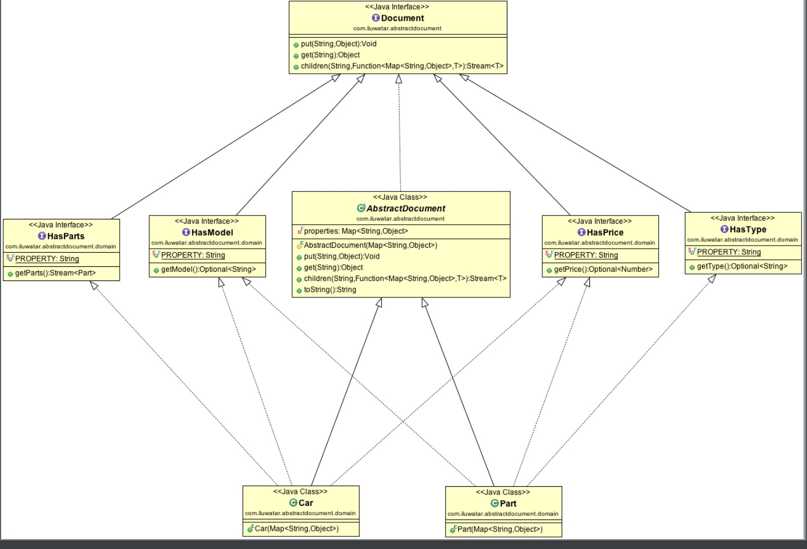

# 抽象文档模式

#### 定义

一种面向对象的结构设计模式，用于在松散类型的键值存储中组织对象并使用类型视图公开数据。该模式的目的是在强类型语言中实现组件之间的高度灵活性，其中新的属性可以随时添加到对象树中，而不会失去对类型安全性的支持。该模式利用特征将类型的不同的属性分隔为不同的接口。

#### 实现

这里用java8实现 主要通过Document 接口实现put和get属性。

这里面有个亮点就是 document的children 方法，很有魔性

```

public interface Document {

    Void put(String key,Object value);

    Object get(String key);

    <T> Stream<T> children(String key, Function<Map<String,Object>,T> constructor);
}

```

```

public abstract class AbstractDocument implements Document {

    Map<String, Object> properties;

    public AbstractDocument(Map<String, Object> properties) {
        Objects.requireNonNull(properties, "properties is not null");
        this.properties = properties;
    }

    @Override
    public Void put(String key, Object value) {
        properties.put(key, value);
        return null;
    }

    @Override
    public Object get(String key) {
        return properties.get(key);
    }

    @Override
    public <T> Stream<T> children(String key, Function<Map<String, Object>, T> constructor) {

         Optional<List<Map<String, Object>>> any = Stream.of(get(key)).
                filter(o -> Objects.nonNull(o))
                .map(o -> (List<Map<String, Object>>) o).findAny();
        return any.isPresent()?any.get().stream().map(constructor):Stream.empty();
    }
}

```